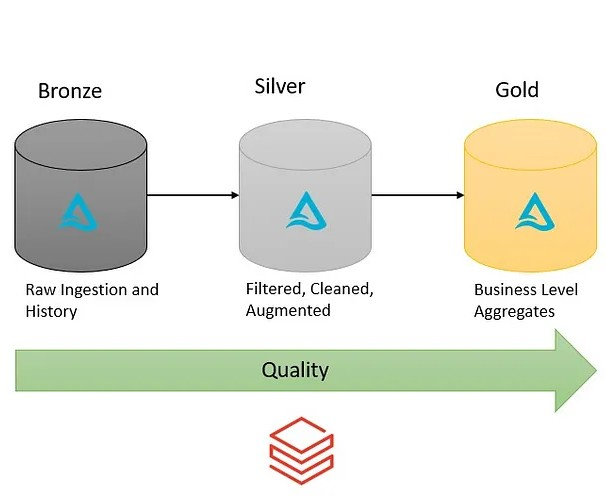

# NYC Yellow Taxi Databricks Pipeline (Bronze → Silver → Gold)

## Introduction
The goal of this project is to perform  optimization on NYC Yellow Taxi data using various tools and technologies, including Databricks, Python, Databricks Notebooks, PySpark, Spark SQL, and Delta Lake. An end-to-end ETL pipeline built on ** Databricks (free edition)** using **PySpark** and **Delta Lake**.  
This project demonstrates how to ingest raw NYC taxi trip data, clean and transform it, and optimize query performance using Delta features like `OPTIMIZE`.

## Architecture

## Technology Used
Programming Language - Python
Databricks ( Free Edition )
PySpark
Spark SQL

## Dataset Used
TLC Trip Record Data Yellow and green taxi trip records include fields capturing pick-up and drop-off dates/times, pick-up and drop-off locations, trip distances, itemized fares, rate types, payment types, and driver-reported passenger counts.

Here is the dataset used in the project - https://github.com/Utt0018/databricks-nyc-taxi/blob/main/data/yellow_taxi.parquet

More info about the dataset can be found here: 

Website - https://www.nyc.gov/site/tlc/about/tlc-trip-record-data.page

## Analytics and Optimization Output on Gold Table

